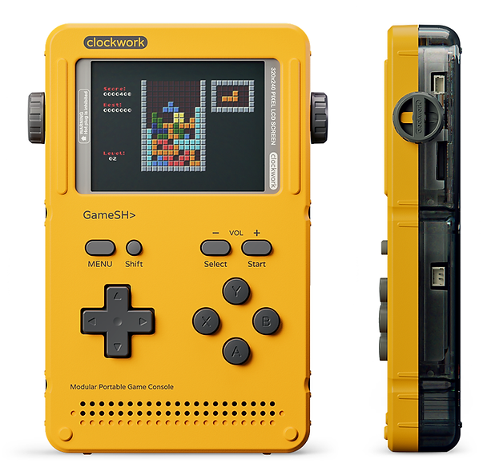
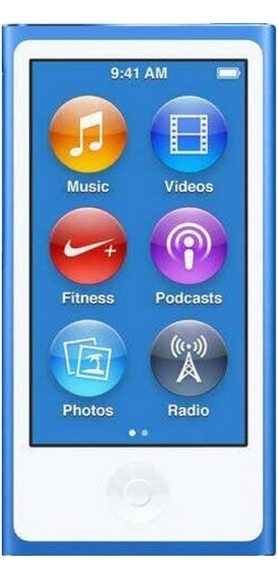

# Key Features
---
- Bluetooth & Wi-Fi support
  * BT for streaming music to headphones.
  * Wi-Fi for copying songs and OS updates
- Retro design
  * Similar to these devices: [GameShell](https://www.clockworkpi.com/product-page/gameshell-kit-yellow)
    and [Pilet](https://soulscircuit.com/pilet)
- Battery powered
- Type C port
  * Charging battery and data transfer
- Touchscreen

# Optional Features
---
- Downloading/Streaming music from popular services like Spotify, SoundCloud, etc.
- AUX output
- Health Status
  * Calculating steps, distance, etc. Strip down version of [Apple Health](https://www.apple.com/health/)

# Design
---
Similar to [GameShell](https://www.clockworkpi.com/product-page/gameshell-kit-yellow)  
However it should have bigger touchscreen and less buttons

Form factor should be simillar to Ipod nano 7th. Maybe slightly bigger.  

Preferebly body is made from alluminium to have "premium" look and feel.

# Hardware
---
On the market there are ready to use RISC-V Linux capable SoMs such as
[LicheeRV Nano](https://wiki.sipeed.com/hardware/en/lichee/RV_Nano/1_intro.html)
or [Milk V Duo](https://milkv.io/duo). However it seems like there are no SoMs
with Wifi&BT module which has good support in upstream kernel.
Which may require making custom PCB based on the SoC.

### Connectivity
- WiFi & BT module.
  * Ideally it should be well supported by the linux kernel, work stable and be low powered.
- USB Type C port
  * The device should be presented as [Mass Storage Gadget](https://docs.kernel.org/usb/mass-storage.html)
    when connected. So the user can upload songs or update the firmware.
  * The device should be charged through this port

### Storage
The device can store it's firmware on eMMC or on external SD card. The later
approach is used on Raspberry Pi 4B as an example. If the eMMC is selected
the SD card should still be used for storing media.

### Touchscreen
Touchscreen is the essential component of the device. It should be around 2.5-3.1 inches in size.

### Buttons
The devices should be convenient to use therefore requires essential **buttons:**
- Home screen button
- Volume Up/Volume down

# Software
---
Since the device probably won't have a lot of RAM, the less software = the better.
Only essential applications which don't require much RAM should be used.

- Linux
  * The device should support LTS kernel preferebly from upstream without custom patches
    for easier maintaining.
- Yocto
  * Main tool for creating custom OS
- Docker
  * For setting up build environment
- GUI Library
  * **QT, LVGL, GTK** or something else should be analyzed based on optimization and cost.
